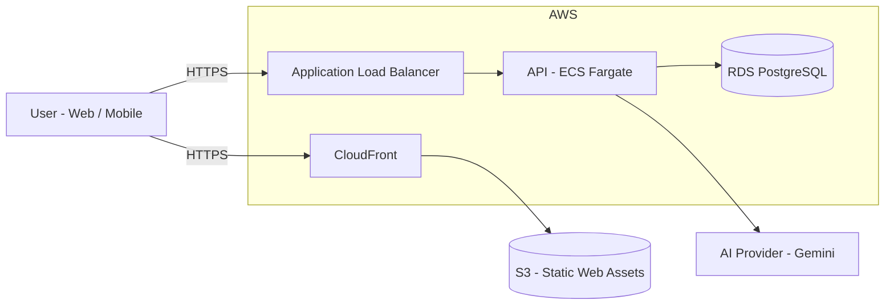
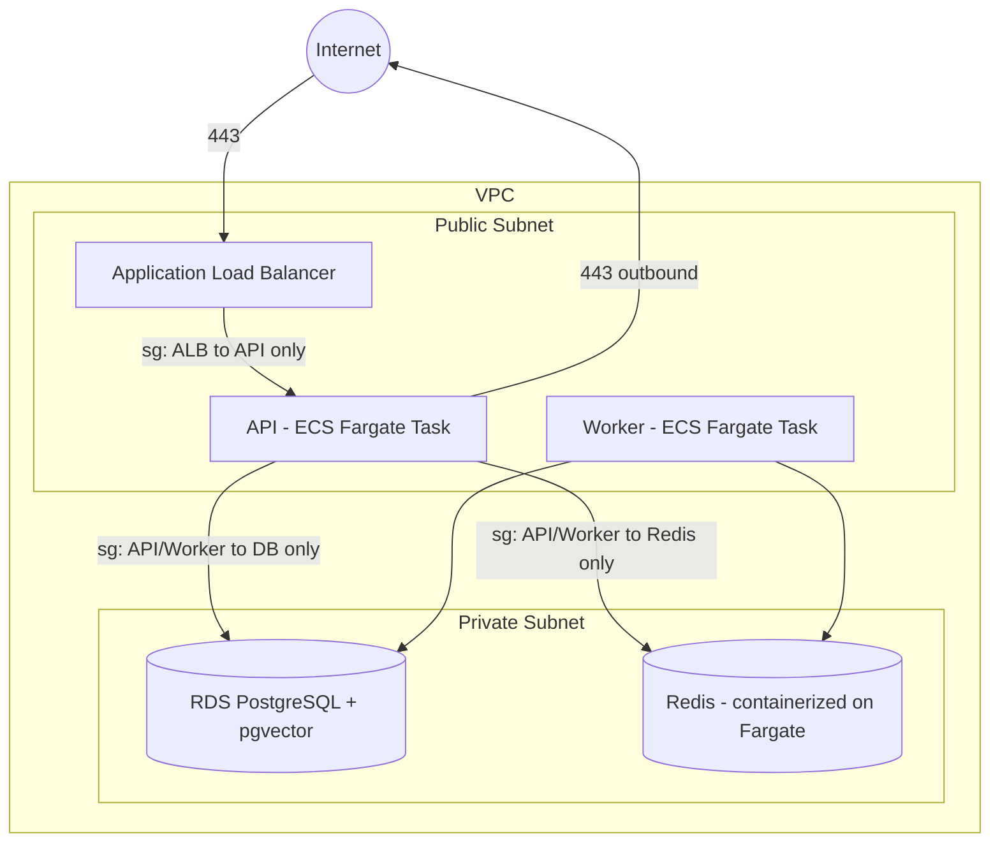
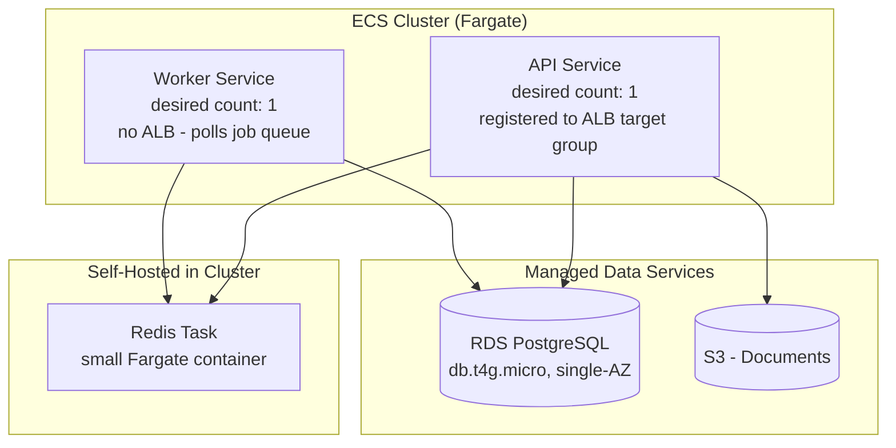

# AWS Deployment Diagram (v1)

Companion diagram to [`docs/system-architecture.md`](../docs/system-architecture.md) — this is the deployment diagram that document deferred ("needs a companion deployment diagram once AWS infrastructure is designed"). It maps the existing Container Diagram's `API`, `Worker`, `DB`, `Cache`, and `Files` boxes onto real AWS infrastructure.

---

## 1. Context — Where AWS Sits Around the Application

This answers the question the system-architecture container diagram left open: where does the `API` box actually run? CloudFront serves the static web bundle; the ALB is the single entry point for API traffic. Gemini stays outside the AWS boundary — same adapter relationship as in the container diagram, just now drawn at the infrastructure level.

## 2. Network — Public vs Private Subnet Boundary

API and Worker sit in the **public subnet** deliberately — this avoids a NAT Gateway (~$32-35/month) while still giving them outbound internet access (for Gemini calls, package pulls) directly through the Internet Gateway. This is safe because a security group restricts inbound traffic to the ALB only; the task is never open to arbitrary internet inbound traffic.

RDS and Redis stay in the **private subnet** regardless of where compute lives — nothing outside the VPC can reach them, and only the API/Worker security group is allowed to reach them from inside.

## 3. Compute Mapping — Container Diagram Boxes to ECS Services

`API` and `Worker` from the container diagram become two ECS services in one cluster — same relationship (Worker consumes jobs the API enqueues), just now a network hop between them instead of an in-process call, foreshadowing the Stage 2 `notification-service` extraction.

**Redis is self-hosted on Fargate rather than ElastiCache.** ElastiCache's smallest node is a real recurring cost (~$9-12/month) for managed HA and persistence this project doesn't need — Redis here only backs a cache and a BullMQ queue, both of which can tolerate a cold restart (cache refills, jobs can be re-enqueued). A plain Redis container on Fargate costs a few dollars a month instead. This is a portfolio-stage trade-off, not a "correct forever" choice — see the revisit note below.

## 4. Cost Notes — What Stays Cheap vs What Changes at Production Scale

| Component | Portfolio/staging choice | Approx. cost | Changes at production scale |
|---|---|---|---|
| ALB | Single ALB, two target groups (blue/green ready) | ~$16-20/mo baseline | Same shape, just more listeners/rules as services grow |
| RDS | `db.t4g.micro`, single-AZ | ~$12-13/mo (or free-tier eligible on a new account) | Multi-AZ for failover, larger instance class under load |
| Fargate (API + Worker + Redis) | Smallest task size (0.25 vCPU / 0.5GB) each, on **Fargate Spot** | ~$4-5/mo combined (vs. ~$12-15/mo on-demand) | Move critical services off Spot once redundancy (desired_count > 1) makes interruptions a non-issue |
| Redis | Self-hosted container on Fargate | included above | ElastiCache once HA/persistence is actually required |
| S3 + CloudFront | Usage-based | Pennies at this project's traffic | Same model, just more traffic |
| NAT Gateway | **Excluded** — public subnet + tight security group instead | $0 (saves ~$32-35/mo) | Move compute to private subnets + NAT once cost is no longer the binding constraint |

Most of this is billed hourly regardless of traffic (ALB, RDS, Fargate tasks) — the real cost lever is **uptime**, not usage. Stopping the ECS services (and optionally the RDS instance) when not actively demoing costs nothing to do and is worth more than any instance-size tuning at this scale.

## 5. What This Diagram Deliberately Leaves Out

- **IAM roles/policies** (task execution role vs. task role, least-privilege scoping) — belongs in the security doc and Terraform, not this topology diagram.
- **Blue-green target-group swap mechanics** — a sequence-diagram candidate once Stage 6 deployment work starts. Drawing it here would mix steady-state topology with a deployment-time process, which isn't this diagram's job.
- **CloudWatch log groups / alarms** — observability doc territory.
- **Terraform module boundaries** — a separate concern from what's actually running.

**Revisit when:** Stage 2 extracts `notification-service` — it becomes a third ECS service here, with its own queue-consumer path. Revisit again when Stage 6 blue-green is implemented (the two-target-group swap earns its own sequence diagram then), and when Redis's self-hosted trade-off stops holding — e.g., if job volume grows enough that losing in-flight jobs on a task restart becomes a real problem, that's the signal to move to ElastiCache.
