# Entity-Relationship Diagram (v1)

This is the relational shape behind everything already decided in [`roles-permissions.md`](../docs/roles-permissions.md), [`settings-design.md`](../docs/settings-design.md), and [`module-feature-map.md`](../docs/module-feature-map.md). Field-level detail for each entity lives in module-feature-map.md — this diagram is the shape (keys, foreign keys, cardinality), not a re-statement of every column.

**Scope:** the 19 entities the architecture plan calls out by name for v1. A handful of supporting tables that module-feature-map.md already documents (`refresh_token`, `mfa_credential`/`mfa_backup_code`, `password_reset_token`, `approval_history`, `payroll_run`, `payslip`, `notification_job`, `comment`, `activity_log`, `user_preference`) are deliberately left out of this diagram — see [§5](#5-deliberately-excluded-from-this-diagram) for why.

---

## 1. Diagram

```mermaid
erDiagram
    TENANT ||--o{ MEMBERSHIP : "scopes"
    TENANT ||--o{ EMPLOYEE : "owns"
    TENANT ||--o{ DEPARTMENT : "owns"
    TENANT ||--o{ TEAM : "owns"
    TENANT ||--o{ PROJECT : "owns"
    TENANT ||--o{ TASK : "owns"
    TENANT ||--o{ ATTENDANCE_RECORD : "owns"
    TENANT ||--o{ LEAVE_TYPE : "owns"
    TENANT ||--o{ LEAVE_REQUEST : "owns"
    TENANT ||--o{ EXPENSE : "owns"
    TENANT ||--o{ DOCUMENT : "owns"
    TENANT ||--o{ NOTIFICATION : "owns"
    TENANT ||--o{ SETTINGS : "owns"
    TENANT ||--o{ AUDIT_EVENT : "owns"
    TENANT ||--o{ SESSION : "scopes"

    USER ||--o{ MEMBERSHIP : "holds"
    USER ||--o| EMPLOYEE : "may link to"
    USER ||--o{ SESSION : "authenticates"
    USER ||--o{ AUDIT_EVENT : "acts as"
    USER ||--o{ NOTIFICATION : "receives"

    ROLE ||--o{ MEMBERSHIP : "assigned via"
    ROLE ||--o{ ROLE_PERMISSION : "bundles"
    PERMISSION ||--o{ ROLE_PERMISSION : "granted via"

    DEPARTMENT ||--o{ TEAM : "contains"
    DEPARTMENT ||--o{ EMPLOYEE : "contains"
    TEAM ||--o{ EMPLOYEE : "contains"
    EMPLOYEE ||--o{ EMPLOYEE : "manages"
    EMPLOYEE ||--o{ ATTENDANCE_RECORD : "logs"
    EMPLOYEE ||--o{ LEAVE_BALANCE : "has"
    EMPLOYEE ||--o{ LEAVE_REQUEST : "requests"
    EMPLOYEE ||--o{ EXPENSE : "submits"
    EMPLOYEE ||--o{ TASK : "assigned"

    TEAM ||--o{ PROJECT : "owns"
    PROJECT ||--o{ TASK : "contains"

    LEAVE_TYPE ||--o{ LEAVE_BALANCE : "tracked as"
    LEAVE_TYPE ||--o{ LEAVE_REQUEST : "categorizes"

    TENANT {
        uuid id PK
        string name
        string slug UK
        string status
        timestamp created_at
    }

    USER {
        uuid id PK
        string email UK
        string password_hash
        string status
        timestamp created_at
    }

    MEMBERSHIP {
        uuid id PK
        uuid user_id FK
        uuid tenant_id FK
        uuid role_id FK
        string status
        timestamp created_at
    }

    ROLE {
        uuid id PK
        string name UK
    }

    PERMISSION {
        uuid id PK
        string name UK
    }

    ROLE_PERMISSION {
        uuid role_id PK,FK
        uuid permission_id PK,FK
    }

    SESSION {
        uuid id PK
        uuid user_id FK
        uuid tenant_id FK
        string refresh_token_hash
        timestamp expires_at
        timestamp revoked_at
    }

    DEPARTMENT {
        uuid id PK
        uuid tenant_id FK
        string name
    }

    TEAM {
        uuid id PK
        uuid tenant_id FK
        uuid department_id FK
        string name
    }

    EMPLOYEE {
        uuid id PK
        uuid tenant_id FK
        uuid user_id "FK,UK - nullable"
        uuid department_id FK
        uuid team_id FK
        uuid manager_id "FK - self-ref, nullable"
        string employment_status
    }

    PROJECT {
        uuid id PK
        uuid tenant_id FK
        uuid team_id FK
        string name
        string status
    }

    TASK {
        uuid id PK
        uuid tenant_id FK
        uuid project_id FK
        uuid assignee_id FK
        string status
        string priority
    }

    ATTENDANCE_RECORD {
        uuid id PK
        uuid tenant_id FK
        uuid employee_id FK
        date work_date
        timestamp checked_in_at
        timestamp checked_out_at
    }

    LEAVE_TYPE {
        uuid id PK
        uuid tenant_id FK
        string name
        string accrual_rule
    }

    LEAVE_BALANCE {
        uuid id PK
        uuid tenant_id FK
        uuid employee_id FK
        uuid leave_type_id FK
        decimal remaining_amount
    }

    LEAVE_REQUEST {
        uuid id PK
        uuid tenant_id FK
        uuid employee_id FK
        uuid leave_type_id FK
        date start_date
        date end_date
        string status
    }

    EXPENSE {
        uuid id PK
        uuid tenant_id FK
        uuid submitted_by "FK -> employee.id"
        string type
        decimal amount
        string status
    }

    DOCUMENT {
        uuid id PK
        uuid tenant_id FK
        string owner_type "polymorphic - not an enforced FK"
        uuid owner_id "polymorphic - not an enforced FK"
        uuid uploaded_by FK
        string storage_key
        string file_name
    }

    NOTIFICATION {
        uuid id PK
        uuid tenant_id FK
        uuid recipient_id "FK -> user.id"
        string type
        boolean read_status
        timestamp created_at
    }

    SETTINGS {
        uuid id PK
        uuid tenant_id "FK,UK(tenant_id,group)"
        string group
        jsonb values
    }

    AUDIT_EVENT {
        uuid id PK
        uuid tenant_id FK
        uuid actor_id "FK -> user.id"
        string action
        string entity_type "polymorphic - not an enforced FK"
        uuid entity_id "polymorphic - not an enforced FK"
        string correlation_id
        timestamp created_at
    }
```

---

## 2. Tenant-Owned vs Platform-Wide

Every entity in this diagram falls into exactly one of three buckets — this is the concrete backing for the project's multi-tenancy rule: *"every relevant query must be scoped by tenant_id."*

| Bucket | Entities | Why |
|---|---|---|
| **Platform-wide, no `tenant_id`** | `tenant`, `user`, `role`, `permission`, `role_permission` | `tenant` is the root, not owned by itself. `user` is a platform-wide identity — the same person can hold memberships in more than one tenant. `role`/`permission`/`role_permission` are a fixed, seeded global catalog (per [`roles-permissions.md`](../docs/roles-permissions.md)), not something each tenant gets its own copy of. |
| **Tenant-owned, carries `tenant_id`** | `membership`, `session`, `department`, `team`, `employee`, `project`, `task`, `attendance_record`, `leave_type`, `leave_balance`, `leave_request`, `expense`, `document`, `notification`, `settings`, `audit_event` | Every business record belongs to exactly one tenant. Every query against these tables filters by `tenant_id` — enforced in the repository/service layer, never left to the caller to remember. |
| **Derived, no table at all** | Reports | See §3. |

## 3. Reports Is a Query Layer, Not a Table

There is no `report` entity in this diagram, deliberately. A generic mutable "report" table would invite storing computed, staleness-prone data that drifts from the source tables it summarizes. Instead, Reports (per [`module-feature-map.md`](../docs/module-feature-map.md)) is implemented as read-only queries/views/aggregates *over* the tables above — `employee`, `attendance_record`, `leave_request`, `task`, `expense` — with the same tenant-scoping and role-scoping rules applied at query time as everywhere else. If a specific aggregate turns out to be expensive to compute on every request, the fix is a cache entry (Redis) or a materialized view refreshed on a schedule — not a hand-maintained table that can fall out of sync with reality.

## 4. `audit_event` Is Append-Only

Unlike every other tenant-owned table in this diagram, `audit_event` has no update or delete path at all — not "delete is restricted by permission," but no `UPDATE`/`DELETE` operation exists in the application layer for this table, period. A row is inserted once, by the one internal service that records audit entries, and never touched again. This is what makes it usable as a security/compliance trail in the first place: if audit rows could be edited or removed through the normal application path, they couldn't be trusted as evidence of what actually happened. The diagram's FK from `audit_event.actor_id` to `user.id` and its polymorphic `entity_type`/`entity_id` reference follow the same read-only assumption — they identify *who did what to what*, never *what it currently is*.

## 5. Deliberately Excluded From This Diagram

These tables are real and already documented in [`module-feature-map.md`](../docs/module-feature-map.md), but adding them here would push this from "ERD v1" into a full physical schema dump before any code exists:

- **Auth internals** — `refresh_token`, `mfa_credential`, `mfa_backup_code`, `mfa_email_otp`, `password_reset_token`. These hang off `session`/`user` and don't change the shape of the business domain.
- **Workflow history** — `approval_history` (hangs off `leave_request`/`expense`), `activity_log` and `comment` (hang off `task`), `notification_job` (hangs off `notification`).
- **Finance execution detail** — `payroll_run`, `payslip` (hang off `employee` + a payroll trigger event).
- **Preference layer** — `user_preference` (per [`settings-design.md`](../docs/settings-design.md) §1, layered on top of `settings`).

**Revisit when:** actual migration work starts on each module (per the daily plan) — each of these gets added to a v2 diagram scoped to that module, instead of front-loading all of it now.

## 6. Likely Indexes

| Table | Index | Purpose |
|---|---|---|
| Every tenant-owned table | `(tenant_id, ...)` composite, tenant_id leading | Nearly every query is tenant-scoped first; an index that doesn't lead with `tenant_id` forces a broader scan before the tenant filter even applies |
| `user` | Unique on `email` | Login lookup, and the constraint that guarantees one account per email |
| `membership` | Unique on `(tenant_id, user_id)` | One membership per user per tenant; also the exact lookup path for "what can this user do in this tenant" |
| `employee` | Unique on `user_id` (where not null); `(tenant_id, department_id)`, `(tenant_id, team_id)`, `(tenant_id, manager_id)` | One employee record per linked user; org-chart and reporting-line queries |
| `task` | `(tenant_id, project_id)`, `(tenant_id, assignee_id)` | Kanban board load (by project) and "my tasks" (by assignee) are the two hottest task queries |
| `attendance_record` | `(tenant_id, employee_id, work_date)` | "Today's attendance for this employee" and history-by-date-range are both covered by this ordering |
| `leave_balance` | Unique on `(employee_id, leave_type_id)` | One balance row per employee per leave type — the constraint *is* the business rule |
| `document` | `(tenant_id, owner_type, owner_id)` | Document list is always "documents attached to this owning entity" |
| `notification` | `(tenant_id, recipient_id, read_status)` | Notification center's default view is "my unread notifications" |
| `settings` | Unique on `(tenant_id, group)` | One settings row per group per tenant — again, the constraint enforces the model from settings-design.md directly |
| `audit_event` | `(tenant_id, created_at)`, `(tenant_id, entity_type, entity_id)`, `(tenant_id, actor_id)` | Audit UI filters by date range, by entity, and by actor — three different access patterns on what will be the largest table in the system |

---

## 7. Five Notes

**Normalization.** The schema is in 3NF for the operational tables — no repeated groups, no derived columns stored redundantly (e.g. `leave_balance.remaining_amount` is maintained transactionally on approval, not recomputed by summing every historical request on read, but it's still a single source of truth per `(employee_id, leave_type_id)`, not duplicated elsewhere). The one deliberate denormalization-adjacent choice is `payslip` as an immutable snapshot of salary at run time (documented in module-feature-map.md) — that's not a normalization violation, it's a historical record that must *not* change when `employee.salary` changes later.

**Transactions.** Three spots in this diagram have a hard multi-write consistency requirement, all already called out in the daily plan: (1) `user` + `membership` creation on registration, (2) `leave_request` status change + `leave_balance` decrement on approval, and (3) `expense`/payroll approval state changes. Each of these must commit atomically — a partial write (balance decremented, request left pending) is a data-integrity bug, not just a UX glitch, so these are wrapped in a DB transaction rather than two sequential application calls.

**Indexes.** Covered in detail in §6 — the short version is that `tenant_id` leads almost every composite index in this system, because tenant-scoping isn't an occasional filter, it's the *first* filter on nearly every query the application ever runs.

**N+1 / query planning.** The highest-risk spots for N+1 are the list views that join across the org hierarchy: an employee list showing department + team + manager name, and a task list showing project + assignee. Both need an explicit join or a batched loader at the ORM level rather than one query per row. The Kanban board (`task` filtered by `project_id`) is the other hot path — it's a single indexed query, but adding comment counts or last-activity timestamps to that same list view later is exactly the kind of change that quietly reintroduces N+1 if each card fetches its own comment count separately.

**Data ownership.** Every table has exactly one module that owns writes to it, even where another module reads it — `employee.salary` is written only by the Employees/Org module, but Finance *reads* it at payroll-run time rather than owning a duplicate copy (documented in module-feature-map.md's Finance section). The same pattern holds for `document` (owned by Documents, but visibility inherited from whatever entity it's attached to) and `settings.finance` group (owned by Settings, surfaced inside Finance's UI). This is what keeps "which module do I change to fix this bug" answerable — a write always has exactly one home, even when several modules need to read the result.
