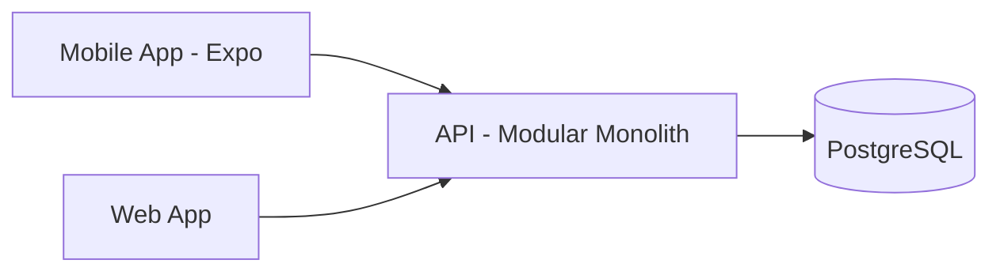
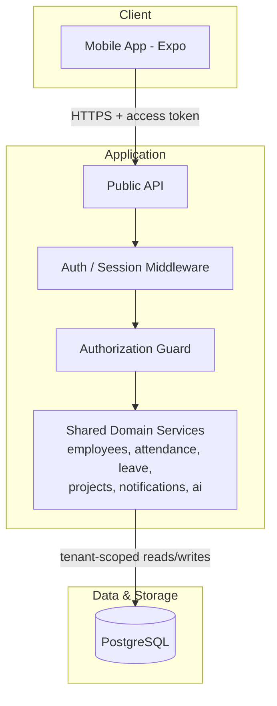
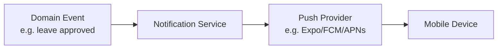

# Mobile Architecture Diagram (v1)

Companion diagram to [`docs/mobile-architecture.md`](../docs/mobile-architecture.md), following the same context → container split used in [`docs/system-architecture.md`](../docs/system-architecture.md).

---

## 1. Context — Mobile as Just Another Client

Mobile is drawn at the exact same level as Web — one arrow into the same API. There is no separate mobile backend and no direct line from Mobile to PostgreSQL.

## 2. Container — Request Path Through Auth/RBAC to Shared Services

Every mobile request passes through the same auth and RBAC layers as a web request before it ever reaches a domain service. Mobile has no bypass path and no elevated trust — a request from the app is authorized exactly the way a browser request is.

## 3. Push Notification Path

The push path starts from the same domain event that would also generate an in-app or email notification — mobile push is one more delivery channel off the same Notification Service, not a separate system.

## 4. What This Diagram Deliberately Leaves Out

- **Offline queue / retry internals** — covered narratively in the doc, not diagrammed, since it is a client-side state machine rather than a new box in the system topology.
- **Token refresh sequence** — a sequence diagram candidate if this becomes a source of bugs worth walking through step-by-step; not needed for the architecture-level picture.

**Revisit when:** a deployment diagram is added for AWS infra — push provider credentials and any mobile-specific rate limiting would show up there, not here.
