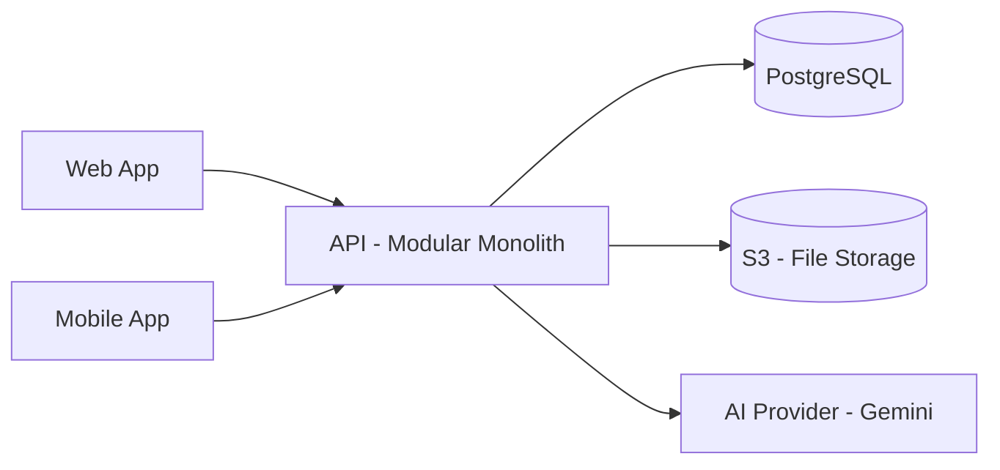
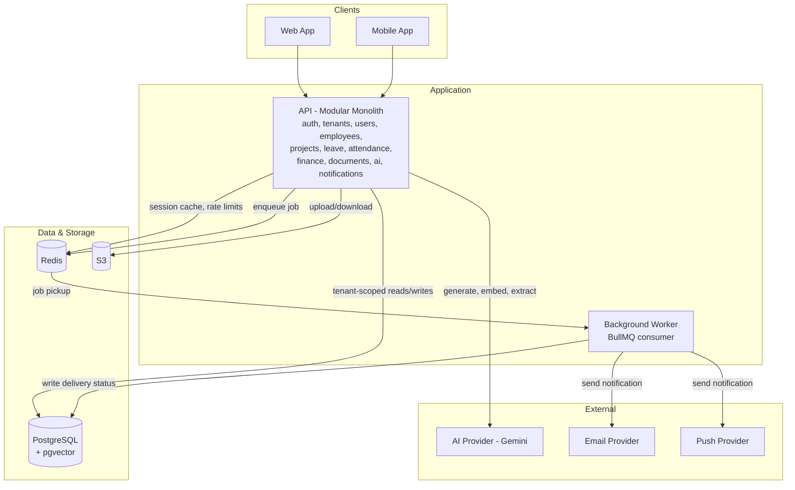

## Product Problem

Growing organizations manage employees, leave, attendance, projects, and tasks across disconnected spreadsheets and point tools. This fragmentation causes manual errors, lost visibility for managers, and wasted admin time on repetitive coordination work.

AI Workforce OS centralizes these workflows in one multi-tenant platform, giving each organization an isolated, secure workspace — with AI assisting on summarization, anomaly detection, and repetitive lookups rather than replacing core record-keeping.

## Users and Roles

The platform supports seven main user roles. Each role represents a different level of responsibility within the system.

### 1. Super Admin

The Super Admin manages the overall SaaS platform rather than a specific organization.

Main responsibilities:
- Manage tenants/organizations
- Activate or deactivate tenants
- View platform-level information
- Manage platform-wide configurations
- Monitor overall system usage

### 2. Tenant Admin

The Tenant Admin manages their own organization within the platform.

Main responsibilities:
- Manage organization settings
- Manage users within the organization
- Assign roles to users
- Manage departments and teams
- Access organization-level reports and configurations

### 3. HR

HR manages employee-related operations within an organization.

Main responsibilities:
- Manage employee profiles
- Handle employee onboarding and offboarding
- Manage leave
- Manage attendance
- Maintain employee documents
- Handle HR-related requests and approvals

### 4. Team Lead

The Team Lead manages employees and work within their assigned team.

Main responsibilities:
- View team members
- Manage or monitor assigned projects and tasks
- Review team attendance
- Approve or reject team leave requests
- Monitor team performance and workload

### 5. Finance Manager

The Finance Manager oversees lightweight payroll and cost-related operations for the organization.

Main responsibilities:
- Trigger and approve the monthly payroll run
- View payroll run history and status
- Review project cost summaries and expense reports
- Approve expense-related workflows
- View organization-level financial reports

Payroll here is intentionally simple: a fixed salary per employee snapshotted into a payslip record on a manual monthly run. No tax engine, no bank integration, no multi-currency support.

### 6. Accountant

The Accountant supports the Finance Manager with day-to-day cost and payroll record-keeping.

Main responsibilities:
- Maintain expense records
- Prepare cost and financial reports
- Assist with processing the monthly payroll run
- Maintain payslip records generated from payroll runs
- Support the Finance Manager's reporting needs

### 7. Employee

Employees use the platform primarily for self-service and their day-to-day work activities.

Main responsibilities:
- View and update their profile
- View attendance
- Request leave
- View their own payslips (read-only)
- Access assigned projects and tasks
- Upload or access relevant documents
- Receive notifications
- Use available AI-assisted features

## Main Modules

The backend starts as a **modular monolith**: a single deployed application, internally split into modules with clear ownership. Each module owns its own database tables and business logic; other modules only reach it through its service layer, never by querying its tables directly. This gives boundary discipline now without the cost of network calls, distributed transactions, or service-to-service auth that a real microservices system requires — and it means a module can later be pulled out into its own service by swapping an in-process call for a network call, rather than a rewrite.

### Platform

**Auth** handles login, registration, password reset, sessions, and refresh-token rotation. It owns credentials, sessions, and refresh tokens. Every other module depends on it to know who is calling.

**Authorization** is not a module with its own tables — it is a cross-cutting concern, enforced as a guard/middleware layer inside every module. Each request is checked against the caller's role and tenant before it reaches business logic.

**Tenants** owns the organization entity itself: tenant records, activation/deactivation, and tenant-level configuration. Every other module's data is scoped by the `tenant_id` this module defines, which is the foundation of the multi-tenant isolation model.

**Users** owns user accounts and role assignment, kept separate from HR data. A user can exist without an employee profile — a Super Admin, for example, has no HR record.

**Audit** maintains an append-only log of sensitive actions (role changes, payroll runs, tenant activation) written to by other modules, giving a single place to answer "who did what, when."

**Notifications** sends and stores in-app, email, and push notifications triggered by other modules — a leave approval, a task assignment, a completed payroll run. It is the first module planned for extraction into its own service, because notification delivery is asynchronous, safely retryable, and can fail without breaking the request that triggered it.

### Workforce

**Employees** owns employee profiles, departments, and teams — the HR-facing identity layered on top of a user account.

**Attendance** owns check-in/check-out records and timesheets, reading employee and team data from the Employees module rather than duplicating it.

**Leave** owns leave requests, approval state, and leave balances. The approval flow involves both Team Lead and HR — the exact approval chain (single-step vs. Team Lead then HR) is still an open design question.

### Project Management

**Projects** owns projects, tasks, the Kanban board, comments, and activity history, including task assignment and realtime updates. Tasks and projects are kept in one module rather than split apart, since a task has no meaning without a parent project.

### Finance

**Finance** owns cost summaries, project expense overview, financial reporting, and a deliberately lightweight payroll: a fixed salary per employee, snapshotted into a payslip record on a manually triggered monthly run. There is no tax engine, bank integration, or multi-currency handling — the scope is intentionally thin so this stays a reporting feature rather than becoming an accounting system.

### Documents

**Documents** owns file uploads and document metadata, search, and AI-assisted document understanding. Binary file content lives in S3; only metadata lives in the database. Document processing (extraction, chunking) is a candidate for future extraction if it becomes slow or expensive enough to isolate from normal request traffic.

### AI

**AI** owns the AI provider adapter (Gemini today, swappable later), the RAG pipeline, and a tool-calling registry that produces summaries and insights. It holds no other module's core data itself — it reaches other modules only through registered read tools (e.g. a project summary tool, a leave balance tool), never through direct table access, so the model can never see or touch more than the tools expose. This module is a candidate for future extraction if AI workloads need scaling or rate limits isolated from normal application traffic.

### Mobile

The mobile app is not a backend module — it is a React Native / Expo client consuming the same APIs as the web frontend, with no separate backend built for it. It covers login, dashboard, attendance, leave, assigned tasks, notifications, and a subset of AI features.

### Module Communication Rule

Within the monolith, a module calls another module's service layer, never its repository or tables directly. This single rule is what keeps module boundaries real instead of aspirational, and it is what makes future extraction low-risk.

## Architecture Diagrams

One diagram cannot stay readable as the system grows, so this follows a context → container split (matching `docs/diagrams/` in the repository structure). Context shows *what talks to what*; container shows *what each piece is made of*.

### Context Diagram

The system from the outside: who uses it, and the one API they both go through.

Both clients go through the same API — there is no separate backend for mobile. The AI provider sits behind an adapter interface rather than being called directly, so it can be swapped later without touching business logic.

### Container Diagram

Inside the API, the same modular monolith now shown with its actual runtime dependencies — cache, background job queue, and the vector store used for RAG — none of which were visible at the context level.

Notes on what's new here versus the context diagram:

- **Redis** does double duty: an application cache and the backing store for BullMQ job queues. It is not shown at context level because it's an implementation detail of the API, not something a client is aware of.
- **Background Worker** is still part of the same deployable monolith at this stage — it's a separate process, not a separate service. This is exactly the boundary that becomes `notification-service` in Stage 2: today it's an in-process queue consumer, later it becomes a network call to another service.
- **PostgreSQL + pgvector** is called out explicitly here because the container diagram is where "where do embeddings live" needs to be answerable — at context level, "PostgreSQL" was enough.
- Internal module boundaries (auth, tenants, leave, etc.) are named inside the API box but not expanded into their own boxes — that level of detail belongs in the Main Modules section above, not in a diagram; a box per module here would violate the "don't create one giant unreadable diagram" rule.

This container diagram will need a companion **deployment diagram** once AWS infrastructure is designed (load balancer, VPC, RDS, replica counts) — that's explicitly deferred until this document is settled.

